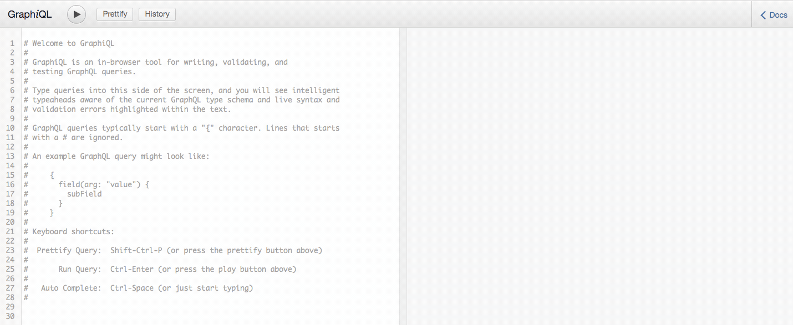

# GraphQL React Application

## Description :clipboard:
> A demo app for using GraphQl, Appollo Client with React and SpaceX API

## GraphQL App DEMO :video_camera:

## Details :scroll:

1. :arrow_right: We have set up our backend server in node and express app ( `localhost:5000/graphql` ) in `server.js`
2. :arrow_right: React application is set up using webpack and babel ( that runs webpack-dev-server for the frontend on `localhost:8080` )
3. :arrow_right: The schema and graphQl queries are created in `schema.js`
4. :arrow_right: We have used axios to fetch data using SpaceX API, in the created queries. ( e.g. API URL: `https://api.spacexdata.com/v3/launches` )
5. :arrow_right: GraphiQL playground is available on `localhost:5000/graphql`. Check demo.
6. :arrow_right: We have used Appolo Client to build UI in React that fetches data from GraphQL
7. :arrow_right: React components are created and wrapped them inside `<AppoloProvider>` and appolo `client` is then passed to these components.
8. :arrow_right: Reach router is used to create routes for home and individual pages.
9. :arrow_right: The `graphql-tag` ( graphQl query parsing utility ) is installed and `gpl` is imported from it. The `gpl` parses GraphQL query strings into the standard GraphQL AST.
10. :arrow_right: Use `gpl` to query the data in front react app, from the schema we have create in our node application in backend.
11. :arrow_right: We have displayed all the data received as response of the query on home page( `Launches.js` ).
12. :arrow_right: When user request for a particular launch item, we query that item by its id and display it on an individual page `Launch.js` 
( e.g. We redirect the user on url `http://localhost:8080/launch/1`, when he request for launch item with id=1 )

## GraphiQL Playground :black_square_button:

## GraphiQL Playground DEMO :video_camera:

## Installation :wrench:

1. Clone this repo by running `git clone https://github.com/imranhsayed/graphql-react-app`
2. `npm install`
3. `npm run server`

## Useful Links :link:

1. [Express GraphQL github link](https://github.com/graphql/express-graphql)
2. [SpaceX-API](https://github.com/r-spacex/SpaceX-API)
3. [SpaceX-Docs](https://docs.spacexdata.com/)
4. [Apollo GraphQL](https://www.apollographql.com/docs/react/) 
Appollo Client is way to use GraphQL to build client applications. It helps you build a UI that fetches data with GraphQL, and can be used with any JavaScript front-end.

## Instructions :point_right:

* Graphiql is a tool that we can use as a client to make request to our server.
* Graph Ql will be avialable at `localhost:5000/graphql`

## Common Commands :computer:

1. `npm run dev:webpack` runs webpack-dev-server for frontend on port 8080 in watch mode 
2. `npm run server` runs node server for backend on `localhost:5000/graphql`
3. `npm run dev` would run both front end and backend servers on their respective ports, using concurrently
4. `start` Runs the server at `localhost:5000/graphql` in non watch mode

## Built With :zap:

1. Node
2. Express
3. React
4. GraphQL
5. Appollo Client
6. Webpack
7. Babel

## License

- **[MIT license](http://opensource.org/licenses/mit-license.php)**
