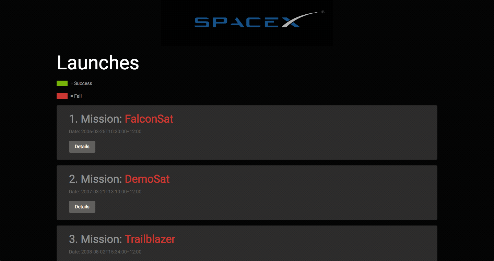

# GraphQL React Application

## Description :clipboard:
:bar_chart: A demo app for using GraphQl with React and SpaceX API

1. We set up our server in node with express app for backend ( `localhost:5000/graphql` ) : server.js
2. We set up our react application usin webpack and babel ( that runs webpack-dev-server for frontend on `localhost:3000` )
3. We create schema and graphQl queries in `schema.js`
4. We use axios to fetch data from SpaceX API inside the created queries. ( e.g. API URL: `https://api.spacexdata.com/v3/launches` )
5. GraphiQL playground is available on `localhost:5000/graphql`. Check demo.
6. We use Appolo Client to build UI in React that fetches data from GraphQL
7. Created components and wrapped them inside `<AppoloProvider>` and passed appolo `client` to these components.
8. Created Routes for home and individual pages using Reach router.
9. Installed `graphql-tag` ( graphQl query parsing utility ) and import `gpl` from it, that parses GraphQL query strings into the standard GraphQL AST.
10. Use `gpl` to query the data in front react app, from the schema we have create in our node application in backend.
11. Display all the data received as the reponse of the query.
12. Also query data by Id when user request for a particular launch item, on a separate page ( e.g. request on url `http://localhost:8080/launch/1` )

## GraphQL App DEMO :video_camera:

## GraphiQL Playground:black_square_button:

## GraphiQL Playground DEMO :video_camera:

## Installation

1. Clone this repo by running `git clone https://github.com/imranhsayed/graphql-react-app`
2. `npm install`
3. `npm run server`

## Useful Links :link:

1. [Express GraphQL github link](https://github.com/graphql/express-graphql)
2. [SpaceX-API](https://github.com/r-spacex/SpaceX-API)
3. [SpaceX-Docs](https://docs.spacexdata.com/)
4. [Apollo GraphQL](https://www.apollographql.com/docs/react/) 
Appollo Client is way to use GraphQL to build client applications. It helps you build a UI that fetches data with GraphQL, and can be used with any JavaScript front-end.

## Instructions :point_right:

Graphiql is a tool that we can use as a client to make request to our server.
Graph Ql will be avialable at `localhost:5000/graphql`

## Common Commands :computer:

1. `npm run dev:webpack` runs webpack-dev-server for frontend on port 8080 in watch mode 
2. `npm run server` runs node server for backend on `localhost:5000/graphql`
3. `npm run dev` would run both front end and backend servers on their respective ports, using concurrently
4. `start` Runs the server at `localhost:5000/graphql` in non watch mode
